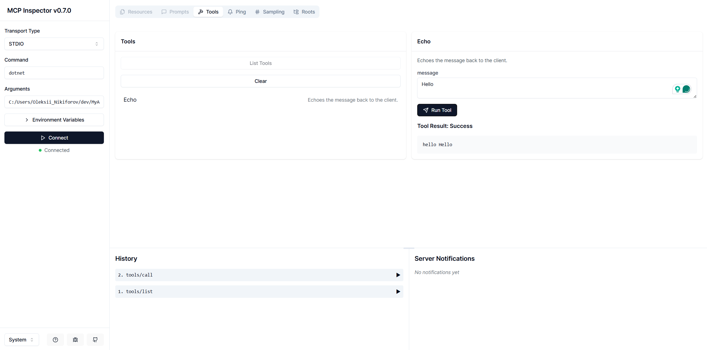

# Model Context Protocol .NET Template

<p align="center">
  
</p>

<p align="center">
  <strong>A protocol for seamless integration between LLM applications and external data sources</strong>
</p>

<p align="center">
  <a href="https://modelcontextprotocol.io">Documentation</a> |
  <a href="https://spec.modelcontextprotocol.io">Specification</a> |
  <a href="https://github.com/orgs/modelcontextprotocol/discussions">Discussions</a>
</p>

This repository contains a [template](https://www.nuget.org/packages/Nall.ModelContextProtocol.Template) for creating a Model Context Protocol (MCP) application in .NET. It provides a basic structure and example code to help you get started with building your own MCP-enabled applications.

## Getting Started

### Install:

```bash
dotnet new install Nall.ModelContextProtocol.Template
```

Verify installation:

```bash
dotnet new list mcp
# These templates matched your input: 'mcp'

# Template Name   Short Name      Language  Tags
# --------------  --------------  --------  -------------
# MCP Server      mcp-server      [C#]      dotnet/ai/mcp
# MCP Server SSE  mcp-server-sse  [C#]      dotnet/ai/mcp
```

Verify output:

```bash
dotnet new mcp-server -o MyAwesomeMCPServer -n MyAwesomeMCPServer --dry-run
# File actions would have been taken:
#   Create: MyAwesomeMCPServer\.vscode\launch.json
#   Create: MyAwesomeMCPServer\MyAwesomeMCPServer.csproj
#   Create: MyAwesomeMCPServer\Program.cs
#   Create: MyAwesomeMCPServer\Properties\launchSettings.json
#   Create: MyAwesomeMCPServer\README.md
#   Create: MyAwesomeMCPServer\appsettings.Development.json
#   Create: MyAwesomeMCPServer\appsettings.json
```

Create from template:

```bash
dotnet new mcp-server -o MyAwesomeMCPServer -n MyAwesomeMCPServer
```

Here is a content of `Program.cs`:

```csharp
using Microsoft.Extensions.Hosting;

var builder = Host.CreateApplicationBuilder(args);
builder.Services
    .AddMcpServer()
    .WithStdioServerTransport()
    .WithToolsFromAssembly();

await builder.Build().RunAsync();

[McpServerToolType]
public static class EchoTool
{
    [McpServerTool, Description("Echoes the message back to the client.")]
    public static string Echo(string message) => $"hello {message}";
}
```

It is a simple echo server that listens for incoming messages and responds with a greeting. You can add more tools by creating additional methods with the `[McpServerTool]` attribute. The `WithToolsFromAssembly()` method automatically registers all tools in the assembly.

### Run Locally

Build from the project directory:

```bash
dotnet build -o Artefacts -c Release
```

Run the inspector:

```bash
npx @modelcontextprotocol/inspector -e DOTNET_ENVIRONMENT=Production dotnet "$(PWD)/Artefacts/MyAwesomeMCPServer.dll"
```

Open inspector in your browser and test the server:

<p align="center">
  
</p>


### Distribute as .NET Tool

Pack from the project directory:

```bash
dotnet pack -o Artefacts -c Release
```

Install the tool globally:

```bash
dotnet tool install --global --add-source ./Artefacts MyAwesomeMCPServer
```

Now, after you installed this tool globally, you can run it from anywhere on your system. The tool will be available as `MyAwesomeMCPServer` (or `myawesomemcpserver`) in your terminal.

💡 You can also create local tool manifest and install MCPs as tools locally.

Run the inspector:

```bash
npx @modelcontextprotocol/inspector -e DOTNET_ENVIRONMENT=Production myawesomemcpserver
```

## Reference

- <https://learn.microsoft.com/en-us/dotnet/core/tools/custom-templates>
- <https://learn.microsoft.com/en-us/dotnet/core/tools/global-tools>